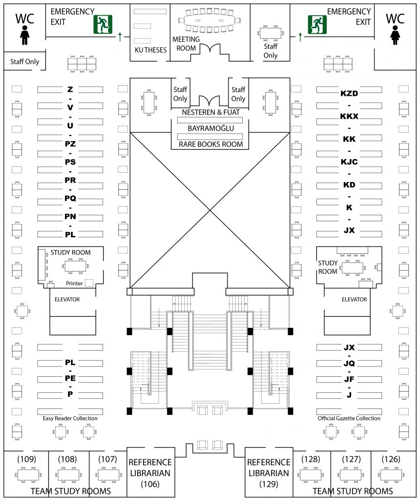

## What is most personal is most universal - Carl R. Rogers

### **Screaming Architecture**



**_In this building plan, they’re not telling me what they were built out of, they were telling me what they were for, this is a [library](https://library.ku.edu.tr/hakkinda/kutuphane-plani/)._**

**The shape of the building is screaming at me what its intention is I am a library I’m there to hold books, it is screaming at me what its intention is and that’s what the architecture of a building ought to do and that’s what the architecture of a software system ought to do it ought to scream at me** what its intention is what it’s for what its requirements are what is use cases are, architecture is about intent the shape of the system the way its components have organized the dependencies between those components is about the intent of the system not about what it’s built around.

### **Hexagonal Architecture**

(Ports and Adapters Architecture)

“**The idea of Hexagonal Architecture is to put inputs and outputs at the edges of our design**. **_Business logic should not depend on whether we expose a REST or a GraphQL API, and it should not depend on where we get data from - a database, a microservice API exposed via gRPC or REST, or just a simple CSV file_**”

“The pattern allows us to isolate the core logic of our application from outside concerns. Having our core logic isolated means we can easily change data source details without significant impact or major code rewrites to the codebase”

```
https://netflixtechblog.com/ready-for-changes-with-hexagonal-architecture-b315ec967749
```

- Created before Clean Architecture
- Share the same **objective**, which is the **separation of concerns**
- Hexagonal architecture does **not** define implementation details
- Dependency Inversion Principle (SOLI**D**)

### **About frameworks:**

Frameworks are wonderful things you can get a lot done with the framework but the author of the framework does not know you and does not care about you the author of the framework does not understand your problems is not writing code to solve your problems they are writing code to solve their problems when you use a framework you make an enormous commitment to that framework you bind your code to it in the very worst case you derive from base classes in the framework, the framework author makes no such commitment to you it is a terribly asymmetric relationship and as an architect if you are an architect or if you’re designer you must be very skeptical of that relationship because you should be thinking that this framework is out to screw me, you should be looking very very carefully at how much you bind to it read the directions you know the documents that the framework author writes, read those directions but you do not follow those directions because the directions that the framework author writes will tell you to couple to the framework intimately because he loves the framework you don’t have to so then what you do is you put the framework behind in architectural boundary you draw those black lines again then you put the framework behind that boundary and you use it but you use it a very careful way so that one day when that framework no longer satisfies your needs you will have some options how many of you have used a framework built it into your system coupled it so tightly into your the system only to find out two years laters there’s a much better framework out there but you have no way to get it there because you are so inextricably bound. You start out with a framework and it’s wonderful it lets you go fast but then a few months later you want to do something that the framework doesn’t want to let you do and the framework starts to fight you, they’re lovely things but they are not pure good they are tools and like any tool, you better know how to use them and how to keep yourself at some distance from them.

```
ITkonekt 2019 | Robert C. Martin (Uncle Bob), Clean Architecture and Design
https://youtu.be/2dKZ-dWaCiU?t=4032
```
